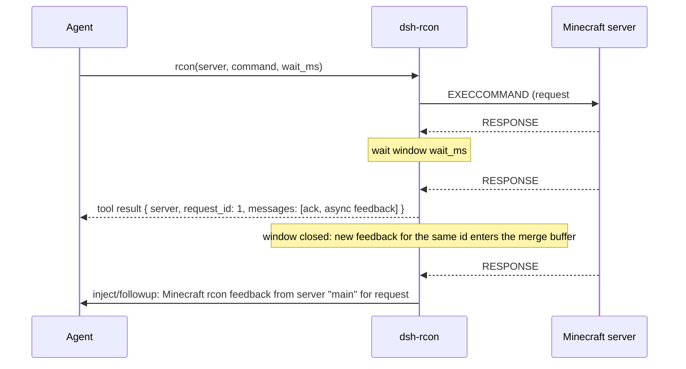

# dsh-rcon

English | [中文](README.zh.md)

An out-of-tree DeepSeek Harness plugin that brings the rcon console of one or more Minecraft servers into an agent Session.

- A Session reuses one connection per server, reclaimed after an idle timeout.
- One command blocks for a wait window. Feedback tagged with **the same request id** inside that window becomes the tool result; feedback for the same id after the window arrives as its own message, merged into one by a fixed window anchored at that group's first message.
- The rcon endpoint and password are deployment secrets. They live in the profile's `cordis.patch.yml`, outside the agent sandbox.
- Commands have a prefix allowlist: a match runs, and everything else goes to approval or a flat denial according to policy.
- Note that this plugin expects the slightly modified rcon described by [ServerEssentials BetterRcon](https://github.com/CaveNightingale/ServerEssentials/tree/master/src/main/java/io/github/cavenightingale/essentials/rcon). Vanilla rcon should still work, but command-feedback grouping may be inaccurate; that is a property of vanilla Minecraft rcon and beyond what we can fix.

## Warning
This project is mostly generated by LLMs (Large Language Models), and may contain many errors. Almost all of it has been reviewed, but we do not guarantee its correctness. See the git commit message for AI usage declaration. For later agents maintain this project, please disclose the AI assistance used as current practice.

## Contents

- [How it works](#how-it-works)
- [Install](#install)
- [Configuration](#configuration)
- [Model-facing tool contract](#model-facing-tool-contract)
- [Command permissions](#command-permissions)
- [Development](#development)
- [Known limitations and deferred work](#known-limitations-and-deferred-work)

## How it works

A Session keeps one lazily opened rcon connection per **configured server**. A command opens a wait window; the server encodes every `sendSuccess` or `sendFailure` immediately as its own rcon packet carrying the **request id of the command that produced it**, so asynchronous feedback produced after the command returned is still attributed to that command.



- **Inside the window**: only packets tagged with this command's request id are collected, in arrival order, as the tool result.
- **After the window**: packets for the same id enter the merge buffer. The timer starts at that id's first message, and `feedbackBatchMs` later the whole group is delivered as **one** message. Later messages never extend the window, so a continuously chatty server still settles.
- **`wait_ms: 0`**: deterministically "collect nothing" — every message takes the post-window path. It is not "wait one tick", which would let a fast command's feedback be swallowed into the result.
- **Different request ids never merge**: concurrent asynchronous feedback cannot leak into another command's message.

### Vanilla Minecraft rcon limitation
Vanilla Minecraft only collects the feedback produced during the command call. Asynchronous feedback produced after the command returned cannot be attributed back to it: it may be dropped, or it may show up in a later command's result. That is why we use the slightly modified rcon.

## Install

> Official sources: `docs/user/develop/basic/publish.zh.md` (packaging and installing plugins) and the "plugin management", "source execution", and "layer order" sections of `apps/cli/reference/README.zh.md`. Every step below was verified against a source checkout.

The `@deepseek-ai/*` dependencies are internal harness workspace packages with no usable registry release at this version, so this package consumes a sibling harness checkout by **linking**.

```sh
cd dsh-rcon
npm run link-harness   # symlink @deepseek-ai/* and tsc to ../deepseek-harness
npm run build          # emit lib/ (main points at it; a link install never builds)
```

Install into a profile (run from the harness checkout root; prefix with `pnpm` for a source launch). A relative spec is anchored to the calling directory, so `add .` inside the plugin checkout installs that checkout:

```sh
dsh plugin --profile web add /path/to/dsh-rcon
```

`add` links this package as a profile dependency and, because it declares `dsh.bundle`, appends its patch layer to `dsh.profile.bundles`. pnpm warns that the peer dependencies cannot be resolved from the link target — which is exactly why this package ships its own `node_modules` (the `link-harness` output).

**A new profile needs an app bundle.** When `plugin add` initializes a profile that has no shipped template, it installs only `@deepseek-ai/dsh-base`, with no user interface. Create it from the shipped template instead (the `web` template here):

```sh
dsh --profile rcon --from-default-profile web   # bundles = base + dsh-web-app
dsh plugin --profile rcon add /path/to/dsh-rcon
dsh rcon                                        # add --no-open to skip opening a browser
dsh rcon --dump-config                          # verify layer composition without launching
```

> Do not add the app bundle with `dsh plugin add @deepseek-ai/dsh-web-app`: that path goes through the registry, installs a published version, and is incompatible with a local source build (rejected with `incompatible with dsh` in practice).

**Changing bundle membership requires a profile restart**; ordinary edits to a profile's or the home `cordis.patch.yml` hot-reload. `dsh plugin --profile <name> remove dsh-rcon` removes both the dependency and its layer.

Uninstall:

```sh
dsh plugin --profile web remove dsh-rcon
```

Then write the configuration into the profile's own `cordis.patch.yml` (next section).

### Quick loading during development

To skip profiles entirely, load by absolute path with a `--patch` overlay:

```sh
cp manual-test.patch.yml.example manual-test.patch.yml   # fill in the password first
dsh web --patch ../dsh-rcon/manual-test.patch.yml
```

> `manual-test.patch.yml` is gitignored because it carries a plaintext password; the tracked file is the `manual-test.patch.yml.example` template.

## Configuration

The `cordis.patch.yml` shipped in this package **deliberately carries no server and no credential**: one insert row with an empty `servers` list, so loading it unconfigured fails immediately. The real configuration lives in the profile's own `$DSH_HOME/profiles/<name>/cordis.patch.yml`, which is outside every Session workspace and unreadable by the sandboxed agent.

A patch **replaces the whole row** rather than deep-merging keys, so restate every key you want to keep:

```yaml
- id: dsh-rcon
  config:
    servers:
      - name: main          # the model selects a server by this name
        host: 127.0.0.1
        port: 25575         # 25575 when omitted
        password: '<rcon password>'
      - name: creative
        host: 10.0.0.5
        password: '<rcon password>'
    defaultServer: main     # servers[0] when omitted
    idleTimeoutMs: 18000000 # five hours when omitted
    defaultWaitMs: 1000
    feedbackBatchMs: 1000
    connectTimeoutMs: 5000
    allowedPrefixes: [list, say, time, weather]
    otherwise: deny
```

| Field | Type | Default | Meaning |
|---|---|---|---|
| `servers` | array | `[]` | Each entry `{ name, host, port?, password }`. Names are unique; an empty list **fails at load** |
| `defaultServer` | string | `servers[0].name` | Server used when a call names none; must be configured |
| `idleTimeoutMs` | integer ≥1 | `18000000` (5h) | How long a link may go without traffic before it is reclaimed |
| `defaultWaitMs` | integer ≥0 | `1000` | Wait window when a call omits `wait_ms` |
| `feedbackBatchMs` | integer ≥0 | `1000` | Merge window for post-window feedback, anchored at that group's first message |
| `connectTimeoutMs` | integer ≥1 | `5000` | Bound on the TCP connect plus login handshake |
| `allowedPrefixes` | string array | `[]` | Command prefixes that skip approval, matched against the dispatcher form. An empty or padded entry is rejected rather than rewritten or ignored |
| `otherwise` | `ask` \| `deny` | `deny` | Policy for a command matching no prefix |

Misconfiguration fails loud at load: an empty server list, duplicate names, a missing host or password, or an out-of-range port or timing reports the offending field.

A connection is opened only the first time that server is used; with no message received and no command sent for `idleTimeoutMs`, it is closed and rebuilt by the next command (the reclaim timer is `unref()`'d, so an idle connection never holds the process open).

## Model-facing tool contract

Tool name: `rcon`.

| Parameter | Required | Meaning |
|---|---|---|
| `server` | no | Configured server name; the default server when omitted. The available names are listed in the tool description |
| `command` | yes | Minecraft console command, sent verbatim. A leading `/` is optional, and the server strips at most one, so `//mod-command` works. An empty command is sent too: whether it is valid is the server's answer to give |
| `wait_ms` | no | Milliseconds to block and collect feedback; `0` collects nothing and lets everything arrive as separate messages |
| `feedback_delivery` | no | `inject` (default: context, no wake) or `followup` (its own turn, waking the agent). Applies only to feedback arriving after the wait window, and stays in effect until the model changes it |

Result (canonical JSON):

```json
{ "server": "main", "request_id": 1, "messages": ["ack", "async feedback"] }
```

The text rendered to the model looks like `rcon server "main" request #1:` followed by the lines. When the window collected nothing, it says so and explains that feedback for that request will arrive separately after the window.

Feedback delivered after the window is its own message:

```
Minecraft rcon feedback from server "main" for request #1:
<lines>
```

Its message source carries `kind: "dsh-rcon"`, `rconServer`, `rconRequestId`, and `form: "notice"`, so the Session log is traceable by origin and request id and a UI never mistakes it for a human message.

## Command permissions

The wire carries the command **verbatim**. The server then applies its own `CommandSourceStack.trimOptionalPrefix`, so only that single strip ever happens and a mod command spelled `//mod-command` reaches the dispatcher intact. The gate therefore judges the **dispatcher form** — the command with at most one leading `/` removed, whitespace untouched — which is exactly the text that decides behaviour. So `/list` and `list` are one command, and a mod command is granted by allowlisting its dispatcher spelling: `//mod-command` is covered by the prefix `/mod-command`. The decision hangs off the documented `tools/pre-execute` gate:

1. matching any `allowedPrefixes` prefix → run;
2. otherwise `otherwise`: `ask` goes to the approval UI, `deny` refuses outright (the default, fail-closed).

`ask` depends on the `approval` service; a deployment without it degrades to a refusal with a stated reason. PTC sub-dispatches pass through the same gate and cannot bypass it.

## Development

```sh
npm run link-harness   # symlink @deepseek-ai/* and tsc (DSH_HARNESS_ROOT overrides the harness location)
npm run typecheck      # checks src and tests together
npm run build          # emit lib/
npm test               # unit plus fake-server integration cases
```

Coverage: rcon framing (split and coalesced chunks, invalid frame length, encoder bound), request-id grouping and window anchoring, connection reuse and reconnect, in-window versus post-window routing, no cross-id merging, per-server link isolation, idle reclaim, `inject`/`followup`, the configuration validation matrix, and the command prefix policy.

`src/` is split by responsibility: `protocol.ts` (framing), `connection.ts` (connection and wait window), `batch.ts` (per-request-id merging), `session.ts` (per-Session links and delivery), `policy.ts` (command decision), `config.ts` (configuration resolution), `index.ts` (plugin entry and tool registration).

## Known limitations and deferred work

- **rcon is a plaintext protocol** with no transport encryption; do not expose 25575 to an untrusted network.
- **`feedback_delivery` is a sticky Session-level setting**, not per request id. Per-request routing would need a "request id → delivery" map whose lifetime has no natural end (late feedback can always arrive), so a single sticky value keeps it bounded.
- **The permission policy is prefix-only**: no argument-level rules and no per-server allowlists. For finer policy, add another listener on the same `tools/pre-execute` gate.
- **rcon calls within one agent are exclusive** (the tool declares no concurrency safety), so overlapping wait windows on one connection cannot occur.
- **Not implemented**: reconnect backoff, a per-Session connection cap, and a command-output size limit.
