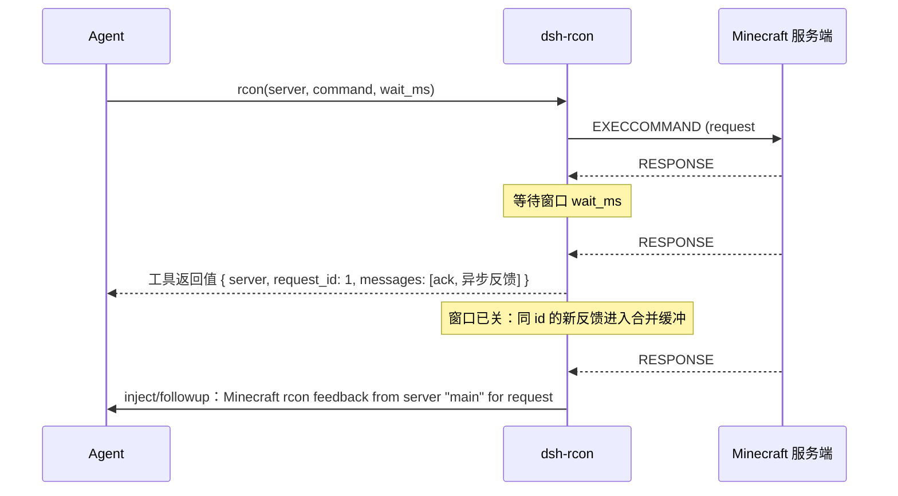

# dsh-rcon

[English](README.md) | 中文

一个树外 DeepSeek Harness 插件：把一台或多台 Minecraft 服务器的 rcon 控制台接进 agent Session。

- 一个 Session 对每台服务器复用一条连接，空闲超时自动回收。
- 一条命令阻塞一个等待窗口，窗口内**带同一 request id** 的反馈作为工具返回值；窗口之后同 id 的反馈作为独立消息送达，并按「该组第一条消息」起算的固定窗口合并成单条。
- rcon 地址与密码属于部署机密，放在 profile 的 `cordis.patch.yml` 里——在 Session 工作区之外，路径也不会交给 agent；这是审慎，不是边界（见[已知限制](#已知限制与后续工作)）。
- 命令有逐服前缀白名单：全局列表 ∪ 该服自己声明的授权，命中直接执行，其余按策略走审批或直接拒绝。
- 请注意此插件期望 [ServerEssentials BetterRcon](https://github.com/CaveNightingale/ServerEssentials/tree/master/src/main/java/io/github/cavenightingale/essentials/rcon) 功能所示的轻微修改版 rcon 。原版理应也能工作，但命令反馈分组可能不准确，这是 Minecraft 原版 rcon 自身的原因，我们无法做什么。

## 警告

本项目大部分由 LLM（大型语言模型）生成，可能存在诸多错误。几乎所有内容都经过了人工审查，但我们不完全保证其正确性。请参见 git 提交信息中的 AI 使用声明。对于后续接手的的 agent ，请按照相同的方法披露 AI 协助情况。

## 目录

- [工作原理](#工作原理)
- [安装](#安装)
- [配置](#配置)
- [模型可见的工具契约](#模型可见的工具契约)
- [命令权限](#命令权限)
- [开发](#开发)
- [已知限制与后续工作](#已知限制与后续工作)

## 工作原理

一个 Session 对每台**已配置服务器**各保留一条 rcon 连接（懒建立）。命令发出后进入等待窗口；服务端把每条 `sendSuccess` 或 `sendFailure` 立刻编码成一个 rcon 包，并带上**发起该命令的 request id**，所以命令返回后才产生的异步反馈也能被归属回原命令。



- **窗口内**：只收集与本次命令同 request id 的包，按到达顺序作为工具返回值。
- **窗口外**：同 id 的包进入合并缓冲；该 id 的第一条消息开始计时，`feedbackBatchMs` 到点后把整组合并成**一条**消息投递。窗口不因后续消息顺延，因此持续刷屏也能收敛。
- **`wait_ms: 0`**：确定性地「不收集」——所有反馈都走窗口外那条路径。这不是「等一个 tick」，避免快命令的反馈被吞进返回值。
- **不同 request id 永不合并**：并发的异步反馈不会串到别人的消息里。

### 注意原版 Minecraft rcon 的限制
原版 Minecraft 只收集在命令调用期间产生的反馈，命令返回后才产生的异步反馈将无法归属回原命令，可能被丢弃，也可能出现在后续的命令返回值里。这是为什么我们使用小幅修改版 rcon 的原因。

## 安装

> 官方依据：`docs/user/develop/basic/publish.zh.md`（打包与安装插件）与 `apps/cli/reference/README.zh.md` 的「插件管理」「源码执行」「加载顺序」章节。本节步骤都在源码 checkout 上实测过。

依赖的 `@deepseek-ai/*` 已按本插件目标的那条 harness 发布线固定——`@deepseek-ai/dsh-{agent,llm,session,tools}@0.2.0-rc.2`、`@deepseek-ai/cordis@~4.0.4`、`@deepseek-ai/schemastery@~3.18.4`——所以在**没有 harness 检出**的机器上直接 registry 安装即可得到一致的依赖图。工具链同样固定：`typescript@*` 现在会解析到无关的 7.x 重写版，`@types/node@*` 会解析到新很多的大版本。

```sh
cd dsh-rcon
npm install            # 从 registry 装 peer 与工具链
npm run build          # 产出 lib/（main 指向它，链接安装不会自动构建）
```

真正在**运行时**被引用的 harness 包只有三个（`@deepseek-ai/dsh-llm`、`@deepseek-ai/dsh-tools`、`@deepseek-ai/schemastery`，都只用到纯值构造器与 schema）；`@deepseek-ai/cordis`、`dsh-agent`、`dsh-session` 只用于类型，已被编译器抹掉。因此安装副本是安全的，装进 profile 时也只要求本包自己的 `node_modules` 存在且可解析。

想对着同级的 harness 检出开发？`npm run link-harness` 会把这些包换成指向 `../deepseek-harness` 的软链（可用 `DSH_HARNESS_ROOT` 覆盖位置），并一并提供 `tsc`；它可以与 `npm install` 叠加，也可以单独使用。

安装进一个 profile（在 harness 检出根目录执行；源码启动加 `pnpm` 前缀）。相对路径 spec 会锚定到调用目录，所以在插件 checkout 里 `add .` 装的就是这个 checkout：

```sh
dsh plugin --profile web add /path/to/dsh-rcon
```

`add` 会把本包链接为 profile 依赖，并因为它声明了 `dsh.bundle` 而把对应的 patch 层追加进 `dsh.profile.bundles`。它不会在 checkout 里跑构建或安装，所以加进来之前 `node_modules` 与 `lib/` 必须已经存在。

**新 profile 需要带应用组合包**。`plugin add` 初始化一个没有随附模板的 profile 时只装 `@deepseek-ai/dsh-base`，不含任何界面。用官方的模板创建方式一步到位（示例以 `web` 模板为例）：

```sh
dsh --profile rcon --from-default-profile web   # bundles = base + dsh-web-app
dsh plugin --profile rcon add /path/to/dsh-rcon
dsh rcon                                        # 加 --no-open 则不自动开浏览器
dsh rcon --dump-config                          # 先验证配置层合成，不启动
```

> 不要用 `dsh plugin add @deepseek-ai/dsh-web-app` 来补应用组合包：那条路径走 registry，会装到已发布版本，与本地源码构建不兼容（实测被 dsh 以 `incompatible with dsh` 拒绝）。

**组合包成员变化需要重启 profile**；而 profile 或 home 里普通 `cordis.patch.yml` 的编辑走热重载。用 `dsh plugin --profile <name> remove dsh-rcon` 可同时移除依赖与对应的配置层。

卸载：

```sh
dsh plugin --profile web remove dsh-rcon
```

然后在 profile 自己的 `cordis.patch.yml` 里写配置（见下一节）。

### 开发期快速加载

不改 profile，用 `--patch` 覆盖层直接按绝对路径加载：

```sh
cp manual-test.patch.yml.example manual-test.patch.yml   # 填密码后再用
dsh web --patch ../dsh-rcon/manual-test.patch.yml
```

> `manual-test.patch.yml` 已在 `.gitignore` 中，因为它携带明文密码；受版本管理的是模板 `manual-test.patch.yml.example`。

## 配置

本包自带的 `cordis.patch.yml` **故意不含任何服务器与凭据**：只有一个插入行，`servers` 为空，因此未经配置就加载会立刻报错。真实配置写在 profile 自己的 `$DSH_HOME/profiles/<name>/cordis.patch.yml`——它在任何 Session 工作区之外，路径也不会交给 agent。

patch 是**整行替换**而非按 key 深合并，所以覆盖时要重述所有想保留的键：

```yaml
- id: dsh-rcon
  config:
    servers:
      - name: main          # 模型用它选择服务器
        host: 127.0.0.1
        port: 25575         # 省略则 25575
        password: '<rcon password>'
      - name: creative
        host: 10.0.0.5
        password: '<rcon password>'
        allowedPrefixes: [fill, setblock]  # 该服自己的授权，叠加在下面的全局列表之上
    defaultServer: main     # 省略则取 servers[0]
    idleTimeoutMs: 18000000 # 省略则 5 小时
    defaultWaitMs: 1000
    feedbackBatchMs: 1000
    connectTimeoutMs: 5000
    allowedPrefixes: [list, say, time, weather]
    otherwise: deny
```

| 字段 | 类型 | 默认 | 说明 |
|---|---|---|---|
| `servers` | 数组 | `[]` | 每项 `{ name, host, port?, password, allowedPrefixes? }`。名字唯一；为空时**加载即失败** |
| `servers[].allowedPrefixes` | 字符串数组 | `[]` | 该服在全局列表**之上**额外授予的前缀。只增不减：逐服列表只能放宽该服可执行的范围，不会收回任何全局授权 |
| `defaultServer` | 字符串 | `servers[0].name` | 调用未指定 `server` 时使用的服务器；必须已配置 |
| `idleTimeoutMs` | 整数 ≥1 | `18000000`（5h） | 一条 link 无任何收发流量多久后回收 |
| `defaultWaitMs` | 整数 ≥0 | `1000` | 调用未指定 `wait_ms` 时的等待窗口 |
| `feedbackBatchMs` | 整数 ≥0 | `1000` | 窗口外反馈的合并窗口，从该组首条消息起算 |
| `connectTimeoutMs` | 整数 ≥1 | `5000` | TCP 连接 + 登录握手的上限 |
| `allowedPrefixes` | 字符串数组 | `[]` | 在**所有**服务器上免审批的命令前缀，按 dispatcher 形式匹配。条目**按原样**使用；空串是所有命令的前缀，所以它等于放行一切 |
| `otherwise` | `ask` \| `deny` | `deny` | 未命中前缀时的策略 |

配置错误在加载时响亮失败：服务器为空、名字重复、缺 host/password、端口或时间越界，都会直接报错并指出字段。

连接只在首次用到该服务器时建立；`idleTimeoutMs` 内既没有收到消息也没有发出命令，连接就会被关闭并在下次命令时重建（回收定时器 `unref()`，空闲连接不会拖住进程退出）。

## 模型可见的工具契约

工具名 `rcon`。

| 参数 | 必填 | 说明 |
|---|---|---|
| `server` | 否 | 已配置服务器名；省略则用默认服务器。可选名字写在工具描述里 |
| `command` | 是 | Minecraft 控制台命令，**原样发送**。前导 `/` 可选，且服务端只会去掉一个，所以 `//mod-command` 可用。空命令同样会发出，是否有效由服务端回答 |
| `wait_ms` | 否 | 阻塞收集反馈的毫秒数；`0` 表示不收集，全部作为独立消息到达 |
| `feedback_delivery` | 否 | `inject`（默认，作为上下文不唤醒）或 `followup`（作为新轮次唤醒）。只作用于等待窗口之后的反馈，且持续生效直到模型再次修改 |

返回值（canonical JSON）：

```json
{ "server": "main", "request_id": 1, "messages": ["ack", "异步反馈"] }
```

渲染给模型的文本形如 `rcon server "main" request #1:` 加各行内容；窗口内没有反馈时会明确说明「该 request 的反馈将在窗口之后单独送达」。

窗口之后送达的反馈是一条独立消息，文本为：

```
Minecraft rcon feedback from server "main" for request #1:
<各行>
```

其消息来源带 `kind: "dsh-rcon"`、`rconServer`、`rconRequestId` 与 `form: "notice"`，因此会话日志里可以按来源和 request id 追溯，UI 也不会把它误当人类消息。

## 命令权限

命令**原样上线**；服务端随后自己做 `CommandSourceStack.trimOptionalPrefix`，因此全程只去一个 `/`，以 `//mod-command` 拼写的 Mod 命令能原封不动到达 dispatcher。门禁因此按 **dispatcher 形式**判定——即最多去掉一个前导 `/`、空白不动的那段文本，它才是真正决定行为的文本。于是 `/list` 与 `list` 是同一条命令；要放行 Mod 命令就按 dispatcher 形式写白名单：`//mod-command` 由前缀 `/mod-command` 覆盖。判定挂在 dsh 文档化的 `tools/pre-execute` 门禁上：

1. 命中目标服务器被授予的任一前缀——全局 `allowedPrefixes` ∪ 该服自己的—— → 放行；
2. 否则按 `otherwise`：`ask` 走审批 UI，`deny` 直接拒绝（默认，fail-closed）。

白名单是逐服的，因此门禁按与工具相同的方式解析目标（调用里的 `server` 参数，省略则默认服）并取两表并集；拒绝理由和审批提示都会写明这条命令会落到哪个服。逐服列表只做加法：`main` 授了 `list`，其他服就不必重写；没写自己列表的服完全继承全局表。指定了本部署未配置的服务器名时，会在进入策略问题之前就拒绝——因为这个调用即使得到授权也无法成功。

前缀按**字面**匹配：命令必须以某个条目拼写的那段文本开头才算命中，不做 trim、不做折叠、不改写任何条目。特别地，`''` 是所有命令的前缀，因此 `allowedPrefixes: ['']` 就是“这里的一切命令都免审批”的写法。

`ask` 依赖 `approval` 服务；未组合该服务的部署会降级为拒绝并给出原因。PTC 的子调用同样经过该门禁，无法旁路。

## 开发

```sh
npm install            # 从 registry 装 peer 与工具链（版本与 harness 发布线对齐）
npm run link-harness   # 可选：把这些包换成指向同级 harness 检出的软链
npm run typecheck      # 同时检查 src 与 tests
npm run build          # 产出 lib/
npm test               # 单元 + 假服务器集成用例
```

`npm install` 与 `npm run link-harness` 都会写 `node_modules/@deepseek-ai/*`，两者互相覆盖；如果你的目标是本地 harness 检出，跑完 `install` 记得再跑一次 `link-harness`。

测试覆盖：rcon 分帧（拆包/粘包/非法帧长/编码上界）、按 request id 分组与窗口锚定、连接复用与断线重连、窗口内/外分流、不同 id 不串组、服务器级 link 隔离、空闲回收、`inject`/`followup`、配置校验矩阵、命令前缀策略。

`src/` 按职责拆分：`protocol.ts`（分帧）、`connection.ts`（连接与等待窗口）、`batch.ts`（按 request id 合并）、`session.ts`（每 Session 的 link 与投递）、`policy.ts`（命令判定）、`config.ts`（配置解析）、`index.ts`（插件入口与工具注册）。

## 已知限制与后续工作

- **rcon 本身是明文协议**，没有传输加密；不要把 25575 暴露到不可信网络。
- **把密码放在工作区外是审慎，不是边界。** 沙箱模式只管控**写入**：`read-only` 仍允许受限进程读取该 OS 用户能读的任何路径，而 agent 的工具进程就以该用户身份运行。因此一次刻意去找 `$DSH_HOME/profiles/<name>/cordis.patch.yml` 的工具调用可以读到密码；这里唯一的保障是该路径不会交到 agent 手上。凭据存储也是同一性质，它自己的文档就写明这一点。
- **`feedback_delivery` 是 Session 级粘性设置**，不是逐 request id。逐条区分需要一张「request id → 投递方式」映射，而它的生命周期无法自然终止（迟到反馈随时可能再来），所以选了单个粘性值以保持有界。
- **权限策略只有前缀维度**：没有参数级规则，也没有按服务器区分白名单。要做更细的策略，可在同一 `tools/pre-execute` 门禁上再加一层监听器。
- **同一 agent 内的 rcon 调用是排他的**（工具未声明并发安全），因此一条连接上不会出现重叠的等待窗口。
- **未实现的运维项**：重连退避策略、单 Session 连接数上限、命令输出长度上限。
